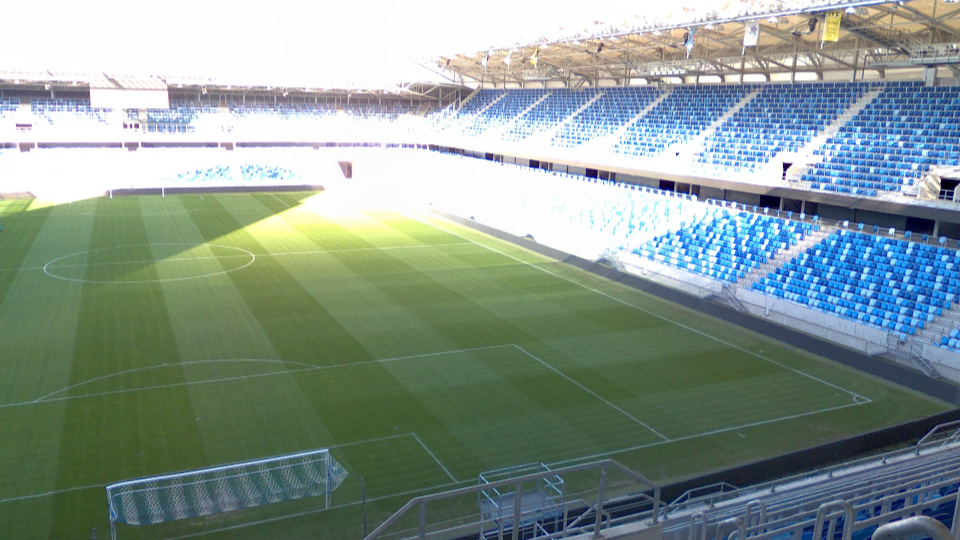
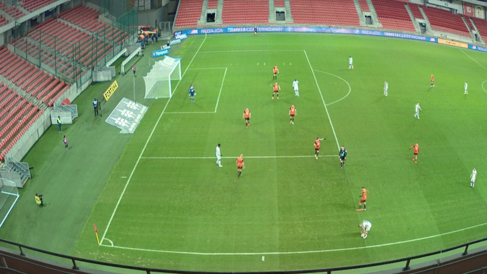

# Football360

This is the official repository for the Football360 dataset. The aim of this dataset is to aid the development and evaluation of computer vision algorithms, primarily the radial distortion correction algorithms, in the sports domain.

This dataset contains 268 panorama images, and was created using the PANONO panoramic camera in 3 football arenas in Slovakia. Each arena was covered from numerous locations on all levels of the tribune, and broadcast camera platforms. The images capture regular football game, pitch maintenance, low/challenging lighting conditions, day and night situations.


| Arena           | Number of images |
| --------------- | ---------------- |
| Bratislava      | 111              |
| Trnava          | 104              |
| Dunajska Streda | 53               |


Download the raw images from the following link:

| File     | Images  | Download Link |
| -------- | --------| ------------- |
| Raw Data | 30,000  | [football360-raw.tar.gz](https://data.deepmagic.sk/fiit/football360/football360-raw.tar.gz) (7.7 GB) |


## Raw Image Probe

Raw images are stored as 16384x8192 JPG, they are the direct result of the PANONO stitching service.


## Pinhole Image Probe

From the panorama images a high number of crop images conforming to the pinhole camera model can be generated by randomly sampling the camera orientation and focal length. If desired, the generated images can be distorted with a chosen radial distortion model to produce very large training set suitable for neural network training.


| Left  | Front  | Right  |
| ------- | ------- | --------|
|  |  |  |


## Distortion Probe

The exporting process supports both polynomial and division models with adjustable number of parameters. The probability distributions of the distortion parameters can be configured by a preset JSON file.

| Barrel | Pincushion |
| ------- | ----- |
|  |  |


## Exported Sets

The exported datasets with their respective configurations can be found in the following table.

| Set name | Purpose    | Images  | Preset    | Download Link |
| -------- | ---------- | ------- | --------- | ------------- |
| A        | Training   | 30,000  | [setA.json](presets/setA.json) | [football360-setA.h5](https://data.deepmagic.sk/fiit/football360/football360-setA.h5) (10.5 GB) |
| B        | Training   | 100,000 | [setB.json](presets/setB.json) | [football360-setB.h5](https://data.deepmagic.sk/fiit/football360/football360-setB.h5) (35.2 GB) |
| C        | Training   | 300,000 | [setC.json](presets/setC.json) | [football360-setC.h5](https://data.deepmagic.sk/fiit/football360/football360-setC.h5) (105.5 GB) |
| V        | Validation | 10,000  | [setD.json](presets/setD.json) | [football360-setV.h5](https://data.deepmagic.sk/fiit/football360/football360-setV.h5) (3.5 GB) |


## Exporting Process

The exporting process consists of two steps:

 - Splitting of the input image folder
 - Rendering cropped images according to the split subsets


To split the input image folder execute the following command:

``` bash
./exporter -in IMAGES_FOLDER -split 90;10 -os split.json
```

To render the cropped distorted images using a preset execute the following command.
Make sure to select either training or validation subset for output.

``` bash
./exporter -in IMAGES_FOLDER -is split.json -ip presets/setA.json \
           -ot TRAINING_IMAGES.H5
```

``` bash
./exporter -in IMAGES_FOLDER -is split.json -ip presets/setA.json \
           -ov VALIDATION_IMAGES.H5
```


## Presets

Presets are defined as JSON files, and they contain the parameters relevant to the export process

``` json
{
    "renderSize": [1920, 1080],
    "scaleSize": [448, 448],
    "compression": "png",
    "nImages": 30000,    
    "view": {
        "pan": [-40, 40],
        "tilt": [-25, -2],
        "roll": [-2, 2],
        "fov": [10, 50]
    },
    "distortion": "poly-2p",
    "distortionParams": {
        "k1": [-0.45, 0.12],
        "epsK2": 0.02
    }
}
```
